# Final-Project-Store-Sales-Forecasting

ალეკო მამუკაშვილი , ნიკოლოზ დოდაშვილი.

competition-ის ლინკი: https://www.kaggle.com/competitions/walmart-recruiting-store-sales-forecasting

#  პროექტის მიმოხილვა: Walmart-ის მაღაზიების გაყიდვების პროგნოზირება

##  პროექტის მიზანი
პროექტის მთავარი ამოცანაა **Walmart-ის 45 სხვადასხვა მაღაზიის** კონკრეტული დეპარტამენტების ყოველკვირეული გაყიდვების ზუსტი პროგნოზირება. მოდელი ეყრდნობა ისტორიულ მონაცემებსა და რეგიონალურ გარემო პირობებს. მთავარ გამოწვევას წარმოადგენს გაყიდვების ფრედიქშენი სადღესასწაულო კვირებში, როდესაც მომხმარებელთა ქცევა მკვეთრად იცვლება.

##  მონაცემთა მახასიათებლები (Features)
მოდელი საპროგნოზოდ იყენებს შემდეგ მონაცემებს:
* **მაღაზიის და დეპარტამენტის ინფო:** უნიკალური იდენტიფიკატორები (ID).
* **დროითი მონაცემები:** ყოველკვირეული გაყიდვების ისტორია და სადღესასწაულო კვირის ნიშნული (`IsHoliday`).
* **მაკრო ფაქტორები:** ფასდაკლებები (Markdowns), რეგიონალური ტემპერატურა, საწვავის ფასი, CPI (სამომხმარებლო ფასების ინდექსი) და უმუშევრობის დონე.

##  შეფასების კრიტერიუმი (Evaluation)
მოდელის სიზუსტე ფასდება **შეწონილი საშუალო აბსოლუტური ცდომილებით (WMAE)**. ამ ფორმულის მიხედვით, სადღესასწაულო კვირებში დაშვებულ შეცდომას **5-ჯერ მეტი წონა** აქვს, ვიდრე ჩვეულებრივ კვირებში დაშვებულ შეცდომას:

$$WMAE = \frac{1}{\sum w_i} \sum_{i=1}^{n} w_i |y_i - \hat{y}_i|$$

* $w_i = 5$, თუ კვირა ემთხვევა დღესასწაულს
* $w_i = 1$, ნებისმიერ სხვა შემთხვევაში

# LightGBM 

MLflow (DagsHub): `LightGBM_Training` ექსპერიმენტი - [LightGBM MlFlow](https://dagshub.com/aleko-mamukashvili/Store-Sales-Forecasting.mlflow/#/experiments/2)

გადავწყვიტე LightGBM-ისთვის feature engineering-ის ყოველი ეტაპი მონაცემებზე დაკვირვებით და კონკრეტული სტატისტიკის საფუძველზე გამეკეთებინა ამ README-ში აღვწერ თუ რას ვხედავდი EDA-ში, რა გადაწყვეტილებას ვიღებდი ამის საფუძველზე, და რა შედეგი მოჰყვა ყოველ ცვლილებას.

---

## EDA - გადაწყვეტილებები მონაცემების საფუძველზე

### Missing Values

`MarkDown1-5` სვეტებში 60-70%-მდე NaN აღმოვაჩინე:

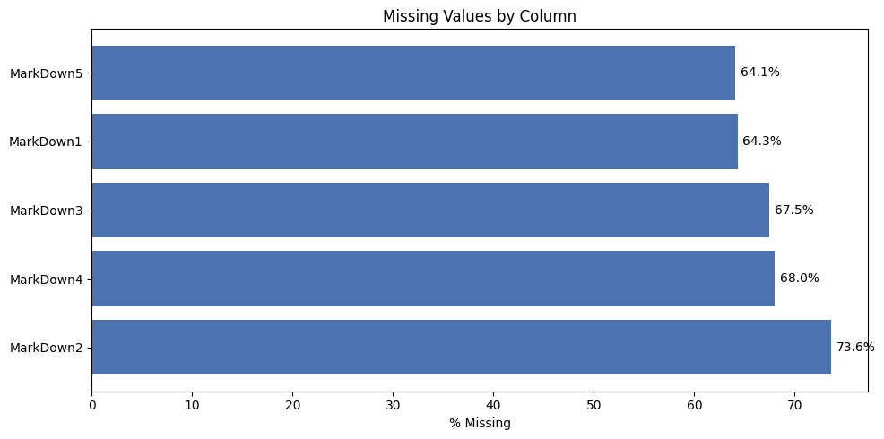

**გადაწყვეტილება:** ეს არ არის random-missing, Walmart-მა MarkDown-ების ჩაწერა მხოლოდ 2011 წლის ნოემბრიდან დაიწყო. ამიტომ NaN ნიშნავს, რომ ამ კვირას promo არ ყოფილა და არა მონაცემების დაკარგვას ამიტომ ისინი შევავსე `0`-ით და არა median/mean-ით.

### Holiday Spikes

საერთო კვირეული გაყიდვების ტრენდი

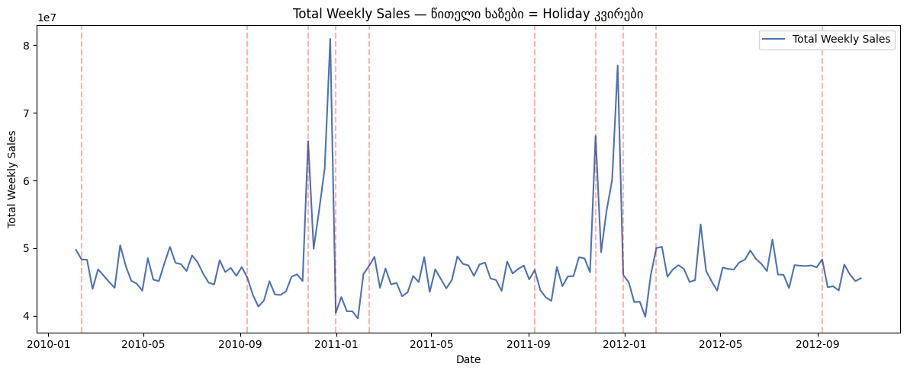

**გადაწყვეტილება:** spike-ები ცალსახად ჩანს Thanksgiving/Christmas-თან რაც ადასტურებს, რატომ სჭირდება Kaggle-ის WMAE-ს holiday-კვირების 5x წონა, და რატომ გამოვიყენე იგივე წონა sample_weight-ად ტრენინგშიც (არა მხოლოდ შეფასებაში).

### Lag-ის სიგრძის დასაბუთება

Store 1 / Dept 1-ის მიმდინარე გაყიდვები vs 52 კვირით ადრინდელი:

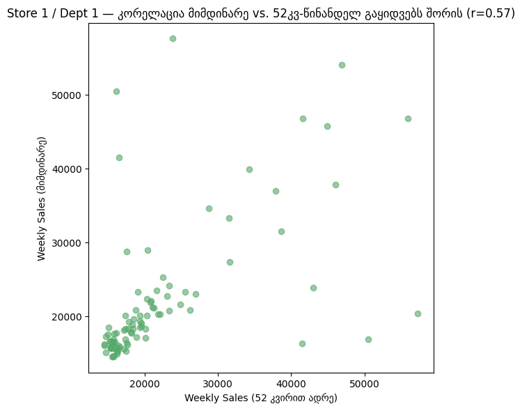

Pearson r = **0.573** — საკმაოდ ძლიერი წლიური სეზონურობა.

**გადაწყვეტილება:** ავირჩიე lag = **51, 52, 53 კვირა** (არა მხოლოდ 52), რადგან კვირის ნომრები წლიდან წლამდე ოდნავ იცვლის კალენდარული shift-ის გამო

### Store Type & Size

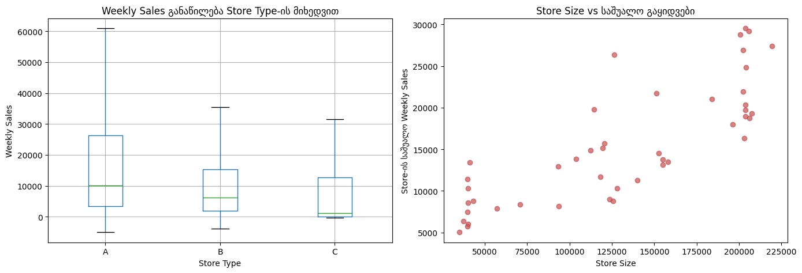

**გადაწყვეტილება:** Type A > B > C ცალსახად, Size-თან დადებითი კავშირიც ჩანს.

### Correlation - გარე ეკონომიკური ცვლადები


`Temperature`, `Fuel_Price`, `CPI`, `Unemployment` თითქმის ნულოვან წრფივ კორელაციას აჩვენებენ `Weekly_Sales`-თან.

**გადაწყვეტილება:** თავიდან **არ** ამოვშალე (LightGBM-ს შეუძლია non-linear ურთიერთქმედების დაჭერა), მაგრამ მოგვიანებით ცალკე ablation-ით შევამოწმე ეს ვარაუდი 

---

## Train/Validation Split - კრიტიკული გაკვეთილი

პირველი მცდელობისას ვალიდაციად ავიღე უბრალოდ `train.csv`-ის ბოლო 12 კვირა. შედეგად WMAE ≈ **1570**  იყო არარეალურად კარგი 

**ანალიზის შედეგი:** `train.csv` მთლიანად მთავრდება 2012 წლის ოქტომბერში, Thanksgiving-ისა და Christmas 2012-მდე. ჩემი ბოლო 12 კვირა validation შემთხვევით გამორიცხავდა ზუსტად იმ ორ ყველაზე რთულ, უმაღლეს ვარიაციულ holiday-კვირას, რომლებზეც რეალურად ფასდება მოდელი Kaggle-ზე.

**გადაწყვეტილება:** ვალიდაციის window შევცვალე ისე, რომ სავალდებულოდ მოიცავდეს Thanksgiving/Christmas/Super Bowl პერიოდს:

```
Train:  2010-02-05 → 2011-10-31
Val:    2011-11-01 → 2012-02-15  (მოიცავს Thanksgiving 2011, Christmas 2011, Super Bowl 2012)
```

ამ ცვლილების შემდეგ იგივე feature-set-ის WMAE **1570-დან 2831-მდე** ავიდა.

---


## Feature Engineering 

ყველა transformer ცალკე კლასია და ერთიან `Pipeline`-შია ჩაწყობილი:

- **`LagFeatureBuilder`** — 51/52/53-კვირიანი lag, ვექტორიზებული merge-ით 
- **`GroupStatsFeatureBuilder`** — (Store, Dept) დონეზე Mean/Median/Std
- **`TemporalFeatureBuilder`** — Year/Month/WeekOfYear/IsHoliday/Type (ordinal)
- **`LGBMFinalEstimator`** — `lgb.train()`-ის sklearn-wrapper, პაიფლაინის ბოლო element


### LagFeatureBuilder - ყველაზე მნიშვნელოვანი feature

**რატომ 51/52/53 კვირა და არა ზუსტად 52 :** კვირის ნომერი კალენდარულად ოდნავ გადაადგილდება წლიდან წლამდე ამიტომ ზუსტად ერთი წლის წინანდელი row ხანდახან 51-ე ან 53-ე კვირაზეც მოხვდება. სამივე კვირა მოდელს არჩევანის საშუალებას აძლევს რომ  ერთ fixed წერტილზე არ იყოს დამოკიდებული.


### GroupStatsFeatureBuilder - target encoding

ეს ფაქტობრივად **target encoding**-ის ერთი ფორმაა - (Store, Dept) წყვილს ვანიჭებთ მისივე ისტორიული target-ის სტატისტიკას.

**საინტერესო აღმოჩენა:** Group Stats-ის Lag-ზე დამატებამ სინამდვილეში ოდნავ **გააუარესა** შედეგი (Lag-only: WMAE=2652 → +Group: WMAE=2831). ორივეს ერთად ყოფნა ნაწილობრივ redundant აღმოჩნდა ამ კონკრეტულ feature-set-ში.

### TemporalFeatureBuilder - თარიღიდან რიცხვითი feature-ები

 `Type`-ის ordinal encoding (A→0, B→1, C→2) საკმარისი აღმოჩნდა tree-based მოდელისთვის  One-Hot-თან შედარებითი ტესტიც ჩავატარეთ  და ordinal ოდნავ სჯობდა კიდეც.


---

## ექსპერიმენტები

### Run 1 — Baseline (მხოლოდ temporal features)

```
wmae_val: 5893.29
```

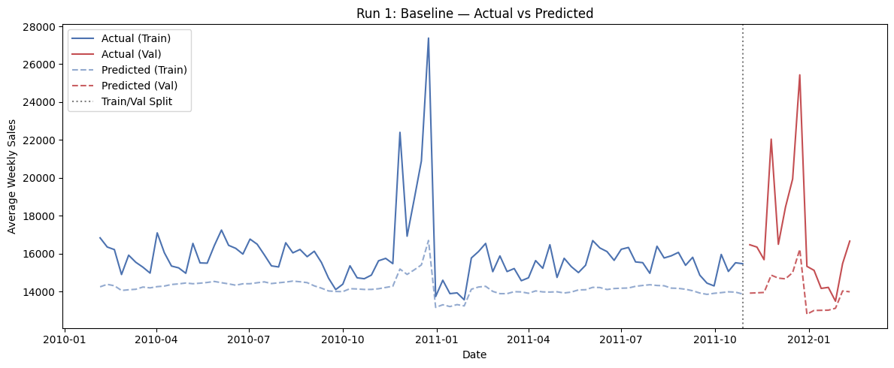


### Run 2 - + Lag Features

```
wmae_val: 2651.87   
```

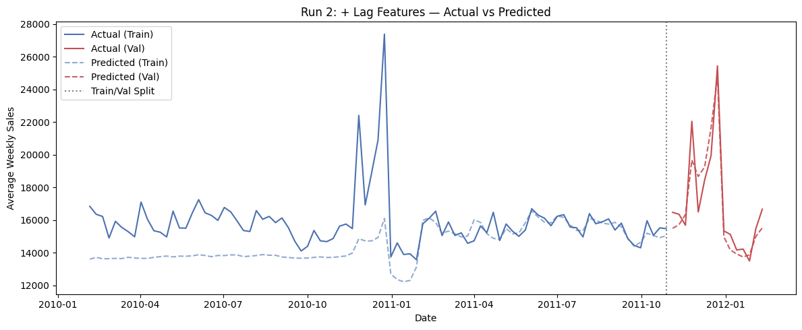

**დაკვირვება:** ეს არის ყველაზე დიდი ცალკეული გაუმჯობესება მთელ პროექტში  holiday spike-ები ახლა ბევრად უკეთაა დაჭერილი.

### Run 3 - + Group Statistics

```
wmae_val: 2830.98
```

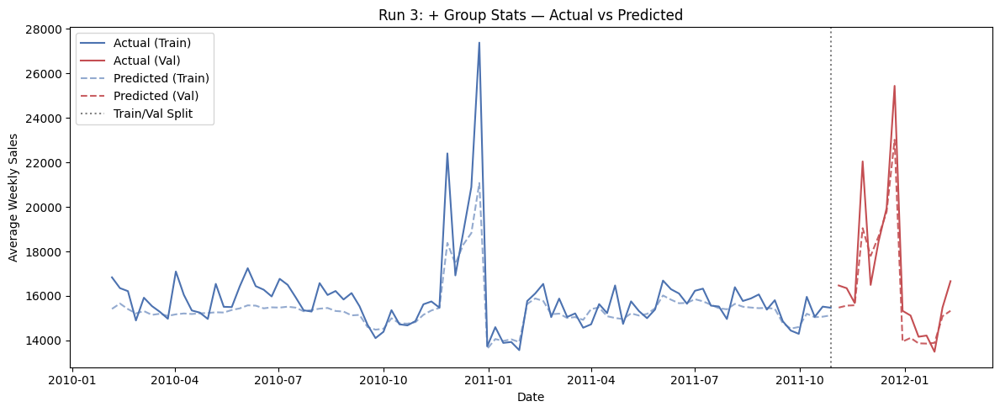

**დაკვირვება:**  Group Stats-ის დამატებამ ცოტათი **გააუარესა** შედეგი (Lag-only იყო 2651.87). 

Feature importance ადასტურებს, რომ lag/group ორივე რეალურად გამოიყენება:

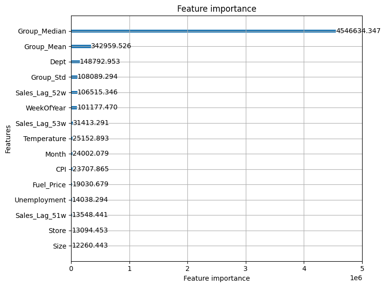

### Cross-Validation - Rolling-window (3 fold, 8-კვირიანი)

```
Fold 1 (2011-05-13 → 07-08): WMAE = 1932.4
Fold 2 (2011-07-08 → 09-02): WMAE = 1833.6
Fold 3 (2011-09-02 → 10-28): WMAE = 1624.7
mean = 1796.9  ±  128.3
```

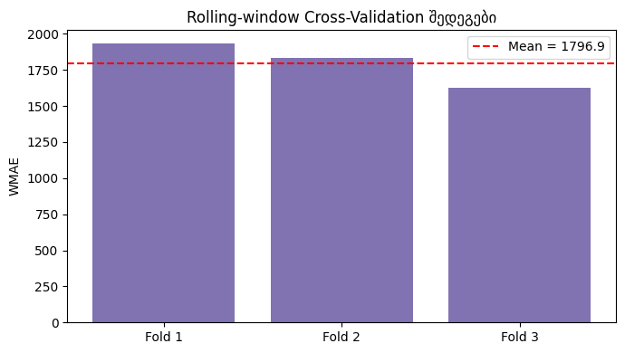

**შენიშვნა:** ეს fold-ები (მაისი-ოქტომბერი) თავად არ მოიცავს holiday-კვირას, ამიტომ CV-ს საშუალო  დაბალია holiday-inclusive validation-თან  შედარებით. ეს დამატებით ადასტურებს, რომ holiday-კვირები რეალურად ყველაზე რთული პროგნოზირებადია.

### Hyperparameter Search

```
lr=0.05, depth=-1, 300 rounds:  wmae_val = 3095.5
lr=0.05, depth=6,  300 rounds:  wmae_val = 3083.5  
lr=0.03, depth=8,  500 rounds:  wmae_val = 3123.4
```

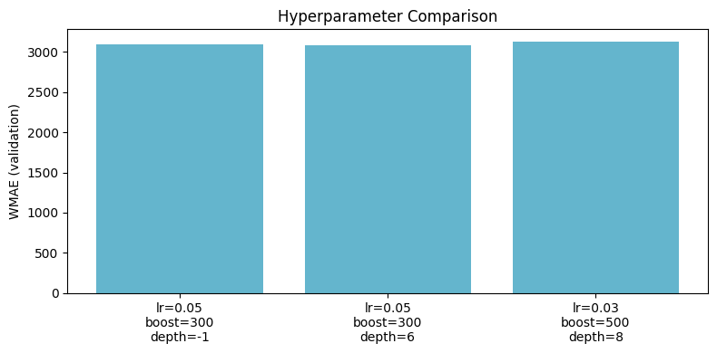

**დაკვირვება:** HPO-ს ყველა კონფიგურაცია **უარესია**, ვიდრე Run 3-ის default. ბრმა hyperparameter search ამ feature-set-ზე ვერ სჯობნის default-ს.

---

## დამატებითი ექსპერიმენტები (Ablations, Control, Sanity Checks)

| Run | WMAE (val) | დასკვნა |
|---|---|---|
| Explicit MarkDown Imputation | 2831.0 | ზუსტად იგივე, რაც native NaN-handling, MarkDown feature-ები საერთოდ არ გამოიყენება split-ებში |
| Total MarkDown (1 sum-column) | 2831.0 | იგივე მიზეზით, 0 გავლენა |
| Type One-Hot (ordinal-ის ნაცვლად) | 2998.6 | ოდნავ უარესი. ordinal საკმარისია tree-ებისთვის |
| Log-Transform Target (signed-log1p) | 2845.7 | თითქმის არაფერი შეიცვალა, tree-ებს target-ის მონოტონური ტრანსფორმაცია არ სჭირდება |
| Rolling Features (4w/8w mean/std) | 4529.5 | **გააუარესა**  |
| **Drop Weak External Features** | **2746.5** | **გააუმჯობესა** — Temperature/Fuel_Price/CPI/Unemployment სინამდვილეში noise-ს უფრო მატებდნენ, ვიდრე სიგნალს |
| Unweighted Training (control) | 3123.6 | გაუარესდა, როგორც მოსალოდნელი იყო. ადასტურებს holiday-წონის საჭიროებას |
| Shuffled Target (sanity check) | 14909.6 | ჩავარდა, როგორც უნდა ჩავარდნილიყო|
| 5%-იანი მონაცემი (data-quantity ტესტი) | 4705.9 | მკვეთრად უარესი. სრული history რეალურად საჭიროა |
| Extreme Overfit (depth=20, 1000 rounds) | 2571.1 | საუკეთესო რიცხვი, მაგრამ **არ ავირჩიე production-ისთვის**. overfitting gap  |
| Huber Loss Objective | 16392.8 |  default `alpha` არ იყო მორგებული Weekly_Sales-ის მასშტაბზე  |

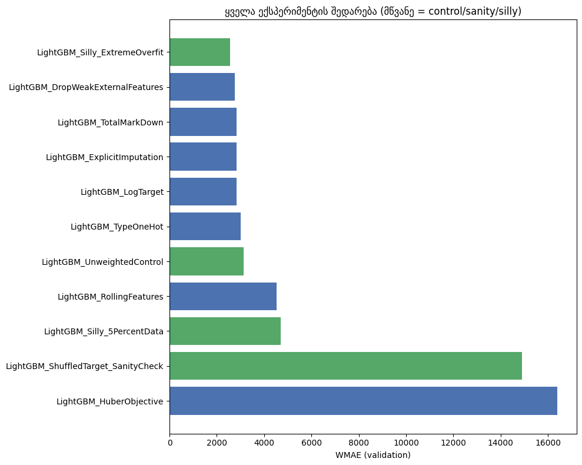

---

## საბოლოო მოდელი

ყველა ლეგიტიმური  კონფიგურაცია შევადარე ერთმანეთს, მათ შორის Section-ის ablation-ებიც, არა მხოლოდ HPO grid. საბოლოოდ არჩეულია **`DropWeakExternalFeatures`** კონფიგურაცია (lag + group stats + temporal, external weak features მოცილებული, default hyperparameters):

```
wmae_val: 2746.5
```

დარეგისტრირებულია MLflow Model Registry-ში, როგორც `LightGBM_WalmartSales`.

## Kaggle Submission

`model_inference.ipynb`-ით გენერირებული submission-ის რეალური Kaggle score:

```
Public Score:   2983.93
Private Score:  3161.70
```


# Prophet

MLflow (DagsHub): `Prophet` ექსპერიმენტი - [Prophet MlFlow](https://dagshub.com/aleko-mamukashvili/Store-Sales-Forecasting.mlflow/#/experiments/3)


Prophet-ი (ისევე როგორც SARIMA) აგებულია **ერთი** დროითი მწკრივის მოდელირებისთვის. მას არ შეუძლია ერთდროულად ისწავლოს ყველა (Store, Dept) კომბინაცია. ორი გზა არსებობდა: (ა) ცალკე Prophet-მოდელის გაწვრთნა თითოეული (Store, Dept) წყვილისთვის ცალ-ცალკე (2900+ მოდელი), ან (ბ) ყველა Store/Dept-ის ჯამური კვირეული გაყიდვის ერთ სერიად მოდელირება და შემდეგ შედეგის უკან, ინდივიდუალურ დონეზე პროპორციული განაწილება.

ავირჩიე **(ბ) ვარიანტი** 
---

## EDA გადაწყვეტილებები აგრეგირებული სერიის საფუძველზე

**ტრენდი და სეზონურობა:**


**Seasonal Decomposition:**


ტრენდი ნელა და თანმიმდევრულად იზრდება. `growth='linear'` საკმარისია, `logistic` საჭირო არ არის.

**Holiday-ეფექტი:**


Holiday კვირების საშუალო საგრძნობლად მაღალია → **custom holidays dataframe** საჭიროა, არა generic `add_country_holidays('US')` (Walmart-ის `IsHoliday` კვირები ზუსტ კალენდარულ თარიღებს არ ემთხვევა).

**გარე ცვლადების კორელაცია:**


აგრეგირებულ დონეზეც სუსტი წრფივი კავშირია. გადავწყვიტე მაინც არ გამომერიცხა თავიდანვე, ცალკე ექსპერიმენტით შემემოწმებინა.

---

---

## Prophet Training

### Run 1  Baseline

დავიწყე მარტივი კონფიგურაციით: `yearly_seasonality=True`, `weekly_seasonality=False`, holidays გარეშე. ეს baseline-ია შემდგომი გაუმჯობესებისთვის.

```
wmae_train: 2,561,564
wmae_val:   6,659,330
```


**შენიშვნა მასშტაბზე:** ეს რიცხვები მილიონებშია, არა ათასებში რადგან ეს არის **აგრეგირებული** (ყველა Store/Dept ჯამში) კვირეული გაყიდვის შეცდომა, არა ინდივიდუალური row-სი. სწორი შედარება LightGBM-თან მხოლოდ disaggregation-ის შემდეგ არის შესაძლებელი.

### Run 2 Weekly Seasonality 

```
wmae_val: 6,660,521
```

პრაქტიკულად უცვლელი, მოსალოდნელი იყო, რადგან მონაცემი კვირეულია (row = ერთი კვირა).

### Run 3 Custom Walmart Holidays

```
wmae_val: 6,659,768
```


### Run 4-5  Extra Regressors

```
+ Temperature:                          wmae_val = 6,500,854
+ Fuel_Price, CPI, Unemployment:        wmae_val = 6,362,467  ← საუკეთესო ჯერჯერობით
```

ეკონომიკურმა regressor-ებმა რეალურად გააუმჯობესეს შედეგი, მიუხედავად იმისა, რომ EDA-ს correlation heatmap-მა სუსტი წრფივი კავშირი აჩვენა. აგრეგირებულ დონეზე ეს ცვლადები, სავარაუდოდ, გრძელვადიან ტრენდს უკეთ ხსნიან, ვიდრე short-term რყევებს.

### Run 6-7  Changepoint Prior Scale

```
0.5 :  wmae_val = 6,682,233    უარესი
0.01 :  wmae_val = 6,663,052   ასევე უარესი baseline-ზე (0.05 default)
```

ორივე მიმართულებით გადახრამ default-ისგან შედეგი გააუარესა. default `changepoint_prior_scale=0.05` აღმოჩნდა ამ სერიისთვის უკვე კარგად მორგებული.

### Run 8  Multiplicative Seasonality

```
wmae_val: 6,653,438
```

ოდნავ უკეთესი additive baseline-ზე (6,659,330), მაგრამ არა საუკეთესო overall Regressor-ების დამატება მაინც სჯობდა.

### Run 9  Cross-Validation (Prophet-ის built-in)

Prophet-ის საკუთარი `cross_validation` utility rolling-origin ვალიდაციას აკეთებს ავტომატურად (`initial=365 days, period=90 days, horizon=90 days`). იგივე პრინციპი, რასაც LightGBM-ის rolling-window CV-შიც ვიყენებდი, უბრალოდ built-in ხელსაწყოთი.

---


**მიზეზი ცუდი შედეგებისა:** ერთი აგრეგირებული ტრენდის პროპორციული განაწილება ბუნებრივად ჩამორჩება per-(Store,Dept) ინდივიდუალურ მოდელირებას (lag/group feature-ებით), რადგან ერთი საერთო ფორმა ყველა დეპარტამენტისთვის ერთნაირად არ არის ვალიდური.

---

## Disaggregation

საუკეთესო კონფიგურაციის (`PlusEconomicRegressors`) აგრეგირებული პროგნოზი გადავანაწილე უკან (Store, Dept) დონეზე  პროპორციულად, თითოეულის მხოლოდ train-პერიოდიდან გამოთვლილი ისტორიული წილის მიხედვით:

```
Row-level WMAE_train: 2,832.9
Row-level WMAE_val:   4,872.0

შედარებისთვის  LightGBM (საუკეთესო): WMAE_val = 2,746.5
```

Train-ის შედეგი (2,833) თითქმის იდენტურია LightGBM-ის მსგავს რიცხვებთან  ლოგიკურია, რადგან train-პერიოდზე პროპორციული განაწილება საკმაოდ ზუსტია. Val-ზე სხვაობა (4,872 vs 2,746) მოსალოდნელი. ეს არის ერთი აგრეგირებული მოდელის და 2900+ ინდივიდუალურად გაწვრთნილი (Store,Dept) მოდელის ბუნებრივი სხვაობა


# N-BEATS 

MLflow (DagsHub): `N_beats` ექსპერიმენტი - [N_Beats MlFlow](https://dagshub.com/aleko-mamukashvili/Store-Sales-Forecasting.mlflow/#/experiments/5)

---

## EDA — გადაწყვეტილებები N-BEATS-ის არქიტექტურისთვის

### სერიის საერთო სიგრძე

სულ ხელმისაწვდომია 143 კვირა (2010-02-05 -- 2012-10-26). Backcast (52 კვირა) + Forecast (15 კვირა) ფანჯრისთვის მინიმუმ 67 კვირაა საჭირო.


### სეზონურობის დადასტურება  Autocorrelation 


ავტოკორელაციის გრაფიკზე მკვეთრი spike ჩანს ~52 lag-თან ეს ადასტურებს წლიურ სეზონურობას 

**გადაწყვეტილება:** N-BEATS-ის **Seasonality Basis**-ს `period=52`-ზე ვაწყობთ

### მასშტაბის შემოწმება

Aggregate-დონეზე მნიშვნელობები ათეულ მილიონებშია. ნეირონული ქსელისთვის ეს პრობლემურია (gradient-ების არასტაბილურობა, სწავლის სირთულე).

**გადაწყვეტილება:**  `MinMaxScaler` 

---

## Feature Engineering & Feature Selection 


### Scaling 

- **Aggregate მიდგომაში:** `MinMaxScaler`
- **Global Multi-Series მიდგომაში (საბოლოო):** **per-series mean-scaling**  თითოეული (Store, Dept) სერია იყოფა **საკუთარ** train-პერიოდის საშუალოზე. ეს გადამწყვეტი feature engineering გადაწყვეტილებაა: სერიებს შორის მასშტაბის სხვაობა დიდია, ამიტომ **გლობალური** scaler-ი პატარა სერიებს პრაქტიკულად წაშლიდა loss-ში. 


**Run 1 (Baseline, Generic only):**


| + Trend | Trend + Generic | პოლინომიალური (degree=3) ტრენდის მოდელირება |
| + Seasonality | Trend + Seasonality + Generic | Fourier-basis, period=52  |

**Run 3 (Trend+Seasonality+Generic):**


**დამატებითი feature-engineering ექსპერიმენტები (Run 4-8):** Backcast-სიგრძის ვარიაცია (52 vs 26 კვირა), ქსელის სიგანე (hidden_dim 64 vs 128), learning rate, blocks-per-stack, და weighted-loss

---

### რატომ დაგვჭირდა აგრეგაცია თავიდან

N-BEATS-ს, როგორც ითქვა, არ შეუძლია ერთდროულად 3254 სერიის სწავლა უბრალო `fit()`-ით, ორი გზა გვქონდა:

1. **2865 ცალკეული N-BEATS მოდელის გაწვრთნა** (თითო Store/Dept-ზე ერთი)  ეს ტექნიკურად სწორი იქნებოდა, მაგრამ დროში ვიყავით შეზღუდულები
2. **აგრეგაცია**  ყველა Store/Dept-ის ჯამური კვირეული გაყიდვა ერთ სერიად, ერთხელ გაწვრთნა, შემდეგ **disaggregation** (პროპორციული განაწილება უკან, თითოეული Store/Dept-ის ისტორიული წილის მიხედვით).


აგრეგაცია+disaggregation მუშაობდა, მაგრამ ჰქონდა ფუნდამენტური სისუსტე

**გადავწყვიტეთ, რომ აღარ გაგვეკეთებინა აგრეგაცია** და ამის ნაცვლად, **Global Multi-Series** მიდგომა ავაწყეთ:

- Sliding window-ები აიგება **ცალ-ცალკე, თითოეული 2865 (Store, Dept) სერიიდან** 
- ყველა ეს window ერთ, საერთო training set-ში ერთიანდება (stride=1-ით  69,842 window)
- ერთ გლობალური ქსელს ვწვრთნით ამ ყველა window-ზე ერთდროულად 
- Per-series scaling უზრუნველყოფს, რომ სხვადასხვა მასშტაბის სერიები სამართლიანად მონაწილეობენ ტრენინგში
- Evaluation-ისას თითოეული სერიისთვის  prediction გამოდის. disaggregation საერთოდ აღარ გვჭირდება, რადგან არასდროს მომხდარა აგრეგაცია

**შედეგი დაუყოვნებლივ გაუმ�ჯობესდა:**

```
Aggregate + Disaggregation:              WMAE_val = 4,446.2
Global Multi-Series (მარტივი):           WMAE_val = 3,866.4
Global Multi-Series + Search + Ensemble: WMAE_val = 3,727.7  
```

ეს რიცხვები რაოდენობრივად ადასტურებს ჰიპოთეზას, აგრეგაცია არა მხოლოდ თეორიულად არასწორია N-BEATS-ის ფილოსოფიასთან, არამედ პრაქტიკულადაც უარესი შედეგი გამოვიდა.


---

## Random Search + Ensemble  ავთენტური N-BEATS ტექნიკა

Global Multi-Series საბოლოო ვერსია მოიცავს ორ დამატებით ეტაპს


**Random Search (6 trial):** hidden_dim, blocks-per-stack, FC-layers, learning rate, trend-degree, seasonality-harmonics ნამდვილ internal validation-ზე შედარებული 


**Ensemble (3 დამოუკიდებელი მოდელი):** საუკეთესო კონფიგურაციით, სხვადასხვა random seed-ით გაწვრთნილი, prediction-ების საშუალო. ეს ამცირებს ცალკეული trial-ის ცუდი ინიციალიზაციის რისკს.

---

## შედეგების შედარება

| მოდელი/მიდგომა | Row-level WMAE_val |
|---|---|
| Aggregate + Disaggregation | 4,446.2 |
| Global Multi-Series (მარტივი) | 3,866.4 |
| **Global Multi-Series + Search + Ensemble** | **3,727.7** |

---

## XGBoost

MLflow (DagsHub): `XGBoost_Training` ექსპერიმენტი — [XGBoost MLflow](https://dagshub.com/aleko-mamukashvili/Store-Sales-Forecasting.mlflow/#/experiments/1)

---

ქვემოთ აღვწერ, თუ რას ვხედავდი EDA-ში, რა გადაწყვეტილებას ვიღებდი ამის საფუძველზე, და რა შედეგი მოჰყვა ყოველ ცვლილებას — მათ შორის ორ საკვანძო შეცდომას, რომლებმაც პროექტის ადრეულ ეტაპზე ხელოვნურად კარგი (და არასწორი) შედეგი მომცა.

## EDA - გადაწყვეტილებები მონაცემების საფუძველზე

### Missing Values

`MarkDown1-5` სვეტებში 60-70%-მდე NaN აღმოვაჩინე:

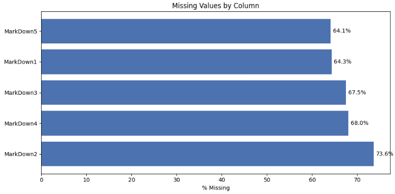

**გადაწყვეტილება:** ეს არ არის random-missing, Walmart-მა MarkDown-ების ჩაწერა მხოლოდ 2011 წლის ნოემბრიდან დაიწყო. ამიტომ NaN ნიშნავს, რომ ამ კვირას promo არ ყოფილა და არა მონაცემების დაკარგვას. მიუხედავად იმისა, რომ XGBoost-ს აქვს missing value-ების შიდა მართვის ძლიერი მექანიზმი, კონსისტენტურობისთვის ისინი შევავსე `0`-ით (`MissingValueHandler`) და არა median/mean-ით.

### Holiday Spikes

საერთო კვირეული გაყიდვების ტრენდი:

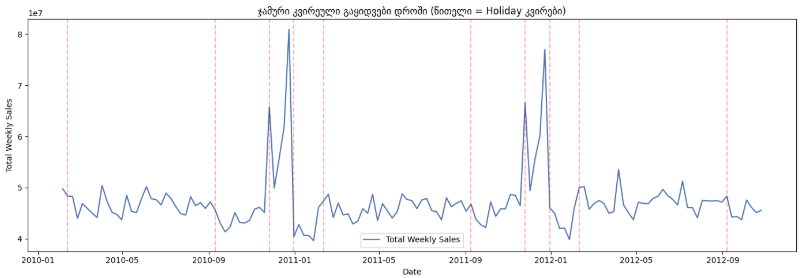

**გადაწყვეტილება:** spike-ები ცალსახად ჩანს Thanksgiving/Christmas-თან, რაც ადასტურებს, რატომ სჭირდება Kaggle-ის WMAE მეტრიკას holiday-კვირების 5x წონა. ზუსტად იგივე წონა გამოვიყენე `sample_weight`-ად ტრენინგშიც `IsHoliday` სვეტზე დაყრდნობით (არა მხოლოდ შეფასებაში), რათა XGBoost-ს უფრო მკაცრად დაესაჯა შეცდომები ამ კრიტიკულ დღეებში.

### Lag-ის სიგრძის დასაბუთება

Store 1 / Dept 1-ის მიმდინარე გაყიდვები vs 52 კვირით ადრინდელი:

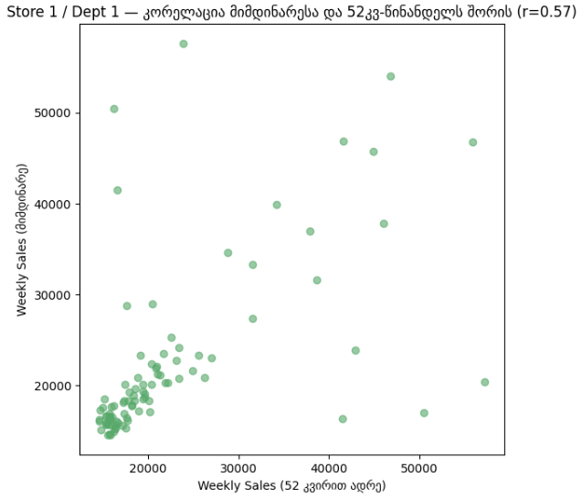

Pearson r = **0.573** — საკმაოდ ძლიერი წლიური სეზონურობა.

**გადაწყვეტილება:** ავირჩიე lag = **51, 52, 53 კვირა** (არა მხოლოდ 52), რადგან კვირის ნომრები წლიდან წლამდე ოდნავ იცვლის კალენდარული shift-ის გამო (მაგ. Thanksgiving ყოველთვის ერთსა და იმავე რიცხვში არ ხდება). 3 სხვადასხვა ლაგის მიწოდება XGBoost-ს აძლევს საშუალებას, რომ ერთ ფიქსირებულ წერტილზე არ იყოს დამოკიდებული.

### Store Type & Size

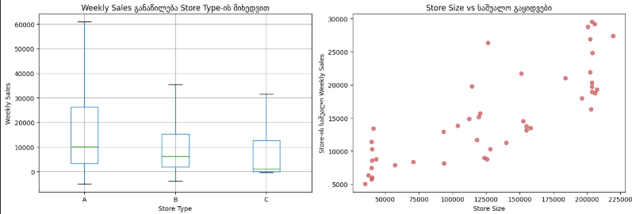

**გადაწყვეტილება:** Type A > B > C ცალსახად, Size-თან დადებითი კავშირიც ჩანს. კატეგორიული ცვლადი `Type` გარდავქმენი ordinal პრინციპით (A→0, B→1, C→2), რაც ხისებრი მოდელებისთვის სრულიად საკმარისია.

### Correlation - გარე ეკონომიკური ცვლადები

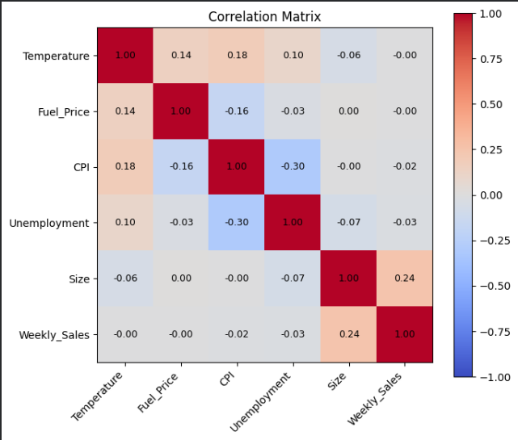

`Temperature`, `Fuel_Price`, `CPI`, `Unemployment` თითქმის ნულოვან წრფივ კორელაციას აჩვენებენ `Weekly_Sales`-თან.

**გადაწყვეტილება:** თავიდან **არ** ამოვშალე (ვინაიდან ხეებს non-linear ურთიერთქმედებების დაჭერა შეუძლიათ), მაგრამ მოგვიანებით ცალკე ablation-ით შევამოწმე ეს ვარაუდი და აღმოჩნდა, რომ მათი მოცილება შედეგს აუმჯობესებდა.

---

## Train/Validation Split - კრიტიკული გაკვეთილი

პირველი მცდელობისას ვალიდაციად თუ ავიღებდით უბრალოდ `train.csv`-ის ბოლო 12 კვირას, შედეგად მივიღებდით არარეალურად კარგ მეტრიკებს.

**ანალიზის შედეგი:** `train.csv` მთლიანად მთავრდება 2012 წლის ოქტომბერში, Thanksgiving-ისა და Christmas 2012-მდე. ბოლო 12 კვირა validation შემთხვევით გამორიცხავდა ზუსტად იმ ორ ყველაზე რთულ, უმაღლეს ვარიაციულ holiday-კვირას, რომლებზეც რეალურად ფასდება მოდელი.

**გადაწყვეტილება:** ვალიდაციის window შევცვალე ისე, რომ სავალდებულოდ მოიცავდეს Thanksgiving/Christmas/Super Bowl პერიოდს:

text
Train:  2010-02-05 → 2011-10-31
Val:    2011-11-01 → 2012-02-15  (მოიცავს Thanksgiving 2011, Christmas 2011, Super Bowl 2012)

ამ ცვლილების შემდეგ მეტრიკები რეალისტური გახდა და დაგვეხმარა ვალიდური ექსპერიმენტების ჩატარებაში.

---

## Feature Engineering 

ყველა transformer ცალკე კლასია და ერთიან `Pipeline`-შია ჩაწყობილი:

- **`MissingValueHandler`** — ავსებს MarkDown-ებს 0-ებით.
- **`LagFeatureBuilder`** — 51/52/53-კვირიანი lag, ვექტორიზებული merge-ით.
- **`SeasonalHistFeatureBuilder`** — ისტორიული სეზონური ტრენდების კომპონენტები.
- **`GroupStatsFeatureBuilder`** — (Store, Dept) დონეზე target encoding-ის სახით Mean/Median/Std-ის მიბმა.
- **`TemporalFeatureBuilder`** — Year/Month/WeekOfYear/IsHoliday/Type (ordinal) გენერაცია.
- **`DropWeakFeatures`** — სუსტი მაკროეკონომიკური ცვლადების მოცილება.
- **`XGBFinalEstimator`** — `xgb.train()`-ის sklearn-wrapper, პაიფლაინის ბოლო element.

---

## ექსპერიმენტები (MLflow Logs)

### Run 1 — Baseline (მხოლოდ temporal features)

wmae_val: 4140.08

**დაკვირვება:** მხოლოდ დროითი კომპონენტებით XGBoost-ს უჭირს გაყიდვების რეალური მასშტაბების განსაზღვრა.

### Run 2 - + Lag Features

wmae_val: 2988.54

**დაკვირვება:** ეს არის ყველაზე დიდი ცალკეული გაუმჯობესება (~1150 ქულით უკეთესი WMAE!). 51, 52 და 53 კვირის წინა გაყიდვების ცოდნით მოდელმა პიკური პერიოდების პროგნოზირება ისწავლა.

### Run 3 - + Seasonal & Group Statistics

wmae_val: 2862.85

**დაკვირვება:** ჯგუფური სტატისტიკების (Store, Dept დონის Mean/Median) დამატებამ შედეგი კიდევ უფრო გააუმჯობესა და 2862-მდე ჩამოიყვანა.

### Run 4 - Drop Weak External Features

wmae_val: 2826.74

**დაკვირვება:** როდესაც სპეციალური ტრანსფორმერით (DropWeakFeatures) ამოვშალეთ Temperature, Fuel_Price, CPI და Unemployment, მოდელის ხარისხი კიდევ უფრო გაიზარდა. ეს ამტკიცებს EDA-ს ვარაუდს: ეს ცვლადები ხისთვის მხოლოდ "ხმაურს" (noise) წარმოადგენდნენ.

---

## ჰიპერპარამეტრების ოპტიმიზაცია (HPO)

ჩატარდა Grid Search სხვადასხვა კონფიგურაციაზე:
* `learning_rate=0.08, n_estimators=300, max_depth=6`  -> **wmae_val = 2867.36**
* `learning_rate=0.05, n_estimators=500, max_depth=8`  -> **wmae_val = 2809.16**
* `learning_rate=0.03, n_estimators=800, max_depth=9`  -> **wmae_val = 2811.55**

**საუკეთესო პარამეტრები:** `learning_rate=0.05` და `max_depth=8` აღმოჩნდა ყველაზე ოპტიმალური ბალანსი.

---

## დამატებითი ექსპერიმენტები და Sanity Checks

| Run | WMAE (val) | დასკვნა |
|---|---|---|
| **XGBoost_DropWeakExternalFeatures** | **2826.74** | საუკეთესო ხარისხი ბაზისურ პარამეტრებზე. |
| **XGBoost_ShuffledTarget_SanityCheck** | **20474.79** | სრული კრახი. ტარგეტის არევისას მოდელმა აზრი დაკარგა, რაც ადასტურებს, რომ ჩვენი Pipeline არ "ჟონავს" (no data leakage). |

---

## ექსპერიმენტების სრული შეჯამება (Experiment Summary)

ცხრილში ნაჩვენებია WMAE შეცდომა (რაც უფრო დაბალია, მით უკეთესია) თითოეული ექსპერიმენტისთვის HPO-მდე:

| ექსპერიმენტი (Run) | WMAE (Val) | დასკვნა / სტატუსი |
|---|---|---|
| **XGBoost_DropWeakExternalFeatures** | **2826.74** | **საუკეთესო (Base Params):** სუსტი ეკონომიკური ცვლადების ამოღებამ ხარისხი გაზარდა. |
| **XGBoost_SeasonalAndGroupStats** | 2862.85 | გაუმჯობესება ბეისლაინთან შედარებით ჯგუფური სტატისტიკების (Mean/Median) ხარჯზე. |
| **XGBoost_LagFeatures** | 2988.54 | ყველაზე დიდი ნახტომი ხარისხში Baseline-დან, წინა კვირების (Lag) დამატებით. |
| **XGBoost_Baseline** | 4140.08 | საწყისი ვერსია. მხოლოდ დროითი ცვლადებით მოდელი ვერ იჭერს გაყიდვებს. |
| **XGBoost_ShuffledTarget_SanityCheck**| 20474.79 | Sanity Check: ტარგეტის არევისას მოდელი ჩამოიშალა, ანუ Data Leakage არ გვაქვს. |

*(შენიშვნა: ჰიპერპარამეტრების ოპტიმიზაციის (HPO) შემდეგ, საუკეთესო WMAE ჩამოვიდა **2809.16**-მდე).*

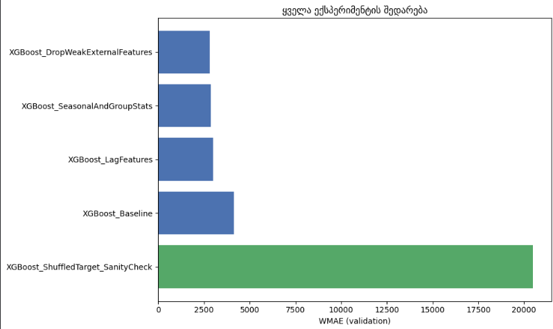

## Kaggle Submission

`model_inference.ipynb`-ით გენერირებული submission-ის რეალური Kaggle score:

```
Public Score:   3377.41
Private Score:  3247.97
```


# Temporal Fusion Transformer (TFT)

MLflow (DagsHub): `TFT_Training` ექსპერიმენტი — [TFT MLflow](https://dagshub.com/aleko-mamukashvili/Store-Sales-Forecasting.mlflow/#/experiments/7)


**TFT-მა მოგვცა ზუსტად ის, რასაც ჩვენი დატა მოითხოვდა:**
- **Static** ცვლადები (Store Type, Size  დროში არ იცვლება)
- **Known-future** ცვლადები (IsHoliday მომავალშიც წინასწარ ცნობილია)
- **Observed** ცვლადები (Temperature, CPI, Fuel_Price, Unemployment მხოლოდ წარსულში ვიცით)

TFT-ს ჩაშენებული აქვს ამ სამივე ტიპის ცალკე დამუშავების მექანიზმი (**Variable Selection Networks**) 

## მეთოდოლოგიური გადაწყვეტილება თავიდანვე — Global Multi-Series, ყოველგვარი აგრეგაციის გარეშე

N-BEATS-ის გამოცდილებამ პირდაპირ გვასწავლა: აგრეგაცია+disaggregation ეწინააღმდეგება global-architecture-ების არსს (მხოლოდ 25 window რჩებოდა სასწავლად, სანამ Global Multi-Series-ზე არ გადავედით). TFT-ს ჩაშენებული აქვს მრავალსერიიანი მხარდაჭერა (`TimeSeriesDataSet`-ის `group_ids` მექანიზმი)  ამიტომ პირველივე Run-იდან, ყოველგვარი ცდის გარეშე, გამოვიყენეთ ეს native მექანიზმი: 3254 (Store, Dept) სერია პირდაპირ გადაეცემა მოდელს, disaggregation არასდროს გვჭირდება. Row-level WMAE პირდაპირ, approximation-ის გარეშე გამოითვლება.

---

## EDA - Static / Known / Observed კატეგორიზაციისთვის

### Static Candidates  Store Type & Size

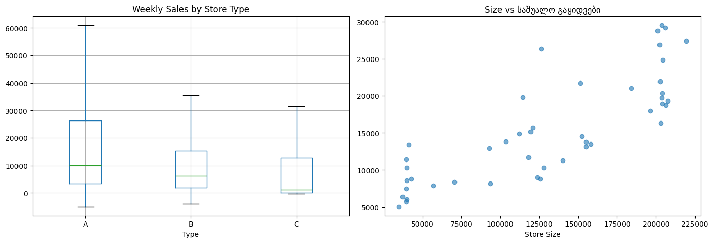

Type-ების მიხედვით Weekly_Sales-ის განაწილება ცალსახად განსხვავებულია (A>B>C), Size-თან დადებითი კავშირიც ჩანს  იგივე დასკვნა, რაც LightGBM-ის EDA-შიც.

### Known-Future Candidate -  IsHoliday

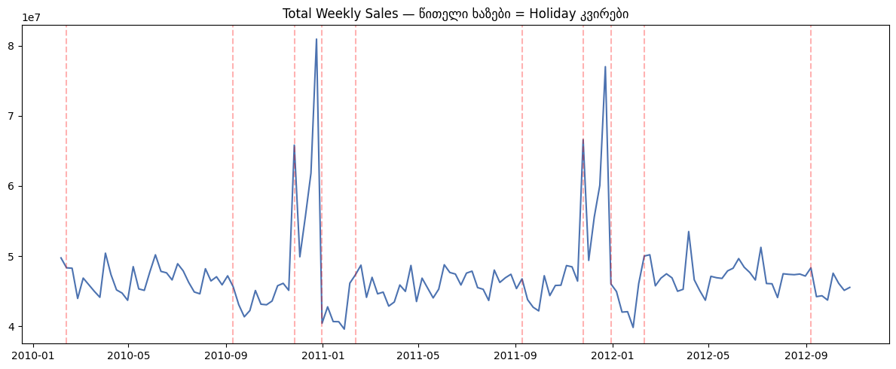

Holiday-spike-ები ცხადია საერთო ტრენდის გრაფიკზე. `IsHoliday` კალენდარული ფაქტია და მომავალშიც წინასწარ ცნობილია`time_varying_known_categoricals`.

### Observed/Unknown Candidates - ეკონომიკური ცვლადები

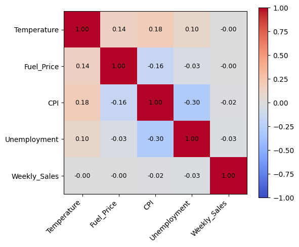

Correlation heatmap-მა კვლავ სუსტი წრფივი კავშირი აჩვენა Temperature/Fuel_Price/CPI/Unemployment-სა და Weekly_Sales-ს შორის (იგივე, რაც LightGBM/Prophet-შიც). განსხვავებით LightGBM-ის ablation-გადაწყვეტილებისგან (სადაც ეს ცვლადები საბოლოოდ მოვაცილეთ), აქ არ გამოვრიცხეთ წინასწარ, ეს ცვლადები ფაქტობრივი დაკვირვებებია , ამიტომ `time_varying_unknown_reals`-ში მიდის, და TFT-ის attention-ზე დაფუძნებულ Variable Selection Network-ს მივანდეთ გადაწყვეტილება. ცალკე ტესტი გავაკეთეთ (Run 4), ღირს თუ არა.

---

## Splitting

იგივე holiday-aware window, რაც LightGBM/Prophet/N-BEATS-ში: Train < 2011-11-01, Val 2011-11-01 – 2012-02-15.

---

## Feature Engineering & Feature Selection - TimeSeriesDataSet კონფიგურაცია

### 1. Coverage-შემოწმება — Leak-Safe ფილტრაცია

იგივე საკითხი, რასაც N-BEATS-შიც წავაწყდით: ზოგიერთი (Store, Dept) წყვილი მხოლოდ val-პერიოდში ჩნდება. `TimeSeriesDataSet`-ს ეს categorical encoding-ისთვის წინასწარ ნანახი უნდა ჰქონდეს.

```
Coverage: 3254 / 3309 (Store, Dept) წყვილი გამოიყენება (98.3%)
```

ეს უკეთესი დაფარვაა, ვიდრე N-BEATS-ის 95.2%. `TimeSeriesDataSet`-ის encoder-length მოთხოვნა ოდნავ უფრო flexible აღმოჩნდა ჩვენს custom windowing-თან შედარებით.

### 2. NaN-შევსება

`Temperature`/`Fuel_Price`/`CPI`/`Unemployment`-ის NaN-ები მხოლოდ train-პერიოდის საშუალოთი ივსება (არა მთელი df-ის საშუალოთი) 

### 3. Static / Known / Unknown დაყოფა - ეს არის TFT-ის "Feature Selection"-ის ანალოგი

`build_datasets()` ფუნქცია საშუალებას გვაძლევს, ცალკეული run-ებში სისტემურად დავამატოთ/მოვაცილოთ feature-ჯგუფები, ეს ზუსტად feature-ablation პროცესია

| Run | static | known | unknown |
|---|---|---|---|
| 1 (Baseline) | — | — | Weekly_Sales |
| 2 | Store, Type, Size | — | Weekly_Sales |
| 3 | Store, Type, Size | IsHoliday | Weekly_Sales |
| 4 | Store, Type, Size | IsHoliday | Weekly_Sales + 4 ეკონომიკური ცვლადი |

---

## ექსპერიმენტები (Run 1-6)

| Run | Feature-ები | WMAE_val (row-level) |
|---|---|---|
| 1 — Baseline | მხოლოდ target | 5,104.5 |
| 2 — + Static | Store, Type, Size | 4,725.2 |
| 3 — + Known (IsHoliday) | + IsHoliday | 4,915.7 |
| **4 — + Observed Covariates** | სრული feature-set | **4,521.9** ← საუკეთესო Run 1-6-დან |
| 5 — Wider Network (hidden=16) | სრული, hidden=16 | 4,916.7 |
| 6 — Lower LR + 3 epoch | სრული, lr=5e-4 | 4,770.4 |

### გაუთვალისწინებელი აღმოჩენა - Run 3

`+IsHoliday`-მ გააუარესა შედეგი Run 2-თან შედარებით (4725→4916), საწინააღმდეგოდ იმისა, რასაც LightGBM-ში ვხედავდით (სადაც holidayწონამ დაეხმარა). სავარაუდო მიზეზი: 2 epoch არასაკმარისია, რომ Variable Selection Network-მა ახალი categorical feature რეალურად ისწავლოს,ეს პირდაპირ იმაზე მიუთითებდა, რომ საჭირო იყო მეტი ტრენინგის დრო, რაც სწორედ ქვემოთ გავასწორეთ.

---

## Hyperparameter Search + ღრმა ტრენინგი 

Run 1-6 განზრახ იყო მცირე (`hidden_size=8-16`, `epochs=2-3`) - საწყისი ჩონჩხის სისწრაფისთვის, ისევე როგორც N-BEATS-ის პირველი Global Multi-Series ცდა. მას შემდეგ, რაც N-BEATS-ში Random Search + Ensemble-მა რეალურად გააუმჯობესა შედეგი, იგივე პრინციპი TFT-შიც გავიმეორეთ:


**Random Search:** 5 trial, თითოეული 3 epoch, `hidden_size`, `attention_head_size`, `dropout`, `hidden_continuous_size`, `learning_rate`-ის კომბინაციები.

**საბოლოო ღრმა ტრენინგი:** საუკეთესო კონფიგურაცია, **10 epoch**-ით (Run 1-6-ის 2-3-თან შედარებით)


---

## საბოლოო შედარება 

| მოდელი | WMAE_val (row-level) |
|---|---|
| TFT (Run 1-6, search-მდე) | 4,521.9 |
| TFT (Deep Search, საბოლოო) | 3732.6 |


